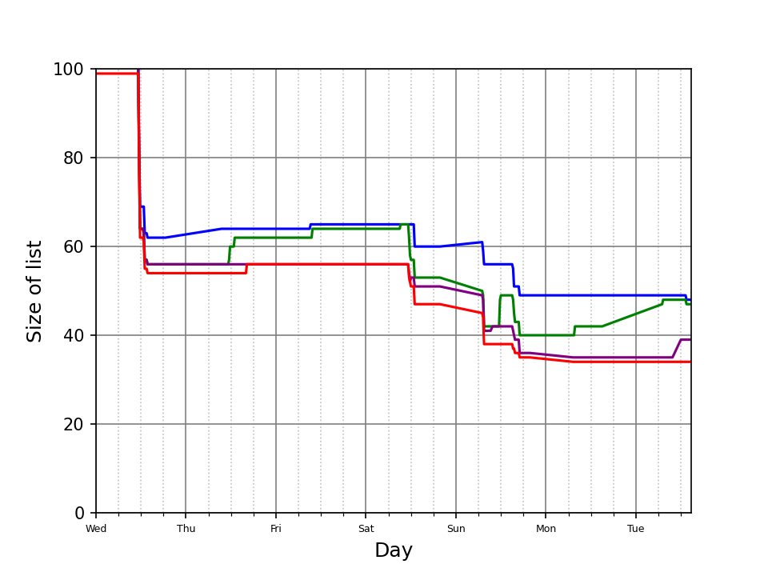

# Public Todo List 

My todo list is public. 

It's updated every hour or so when my machine is running. That script also updates a chart showing the size of the lists over time.  

<pre>
 
</pre>

