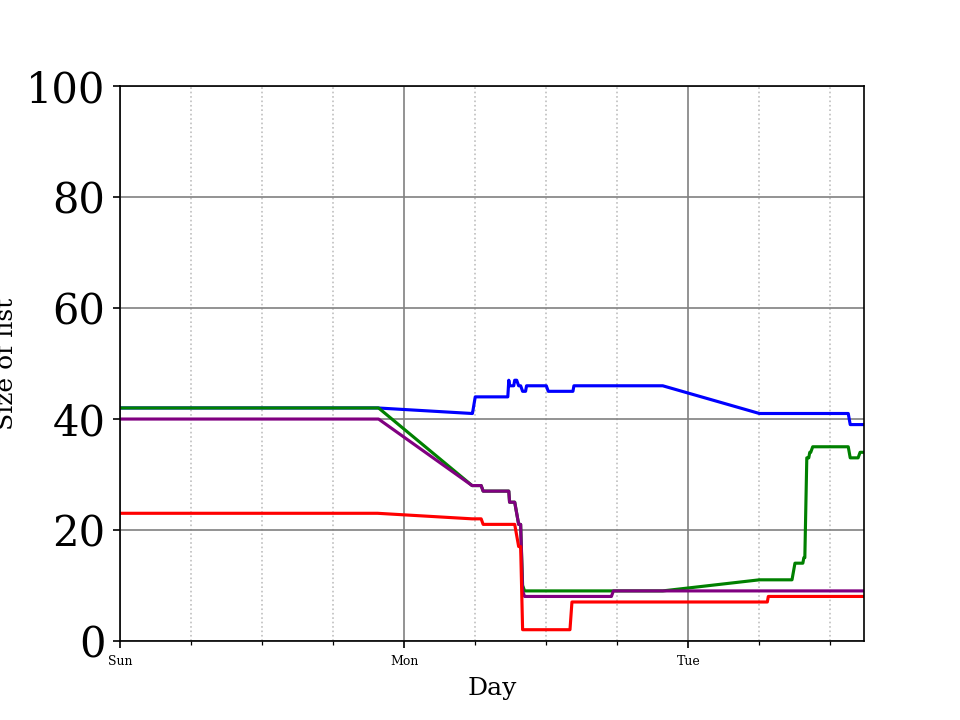
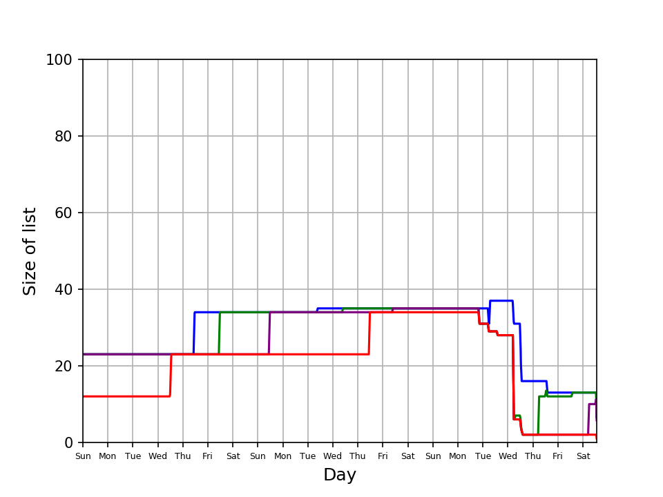
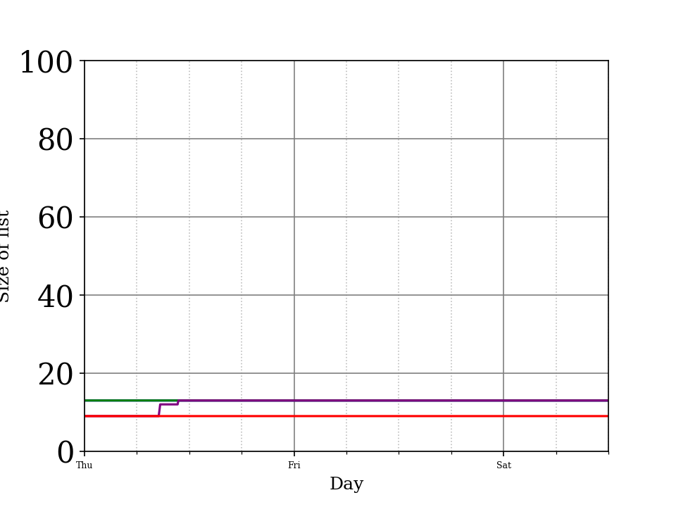

# Public Todo List 

My todo list is public. It's split into three parts. My personal list, my eQuality Time list and my RHUL teaching list.  The personal and EQT lists are public and I'll gradually move the RHUL to being more and more public as time goes on.  

Each list also has an associated 'stress' chart. In general high red lines arebad (they are tasks that are older than sevens). Above you can see the combined 'ultimate stress' chart.  

It's updated every hour or so when my machine is running. That script also updates a chart showing the size of the lists over time.  

## Personal list

<pre>
 
</pre>

## Work list 

<pre>
 
</pre>

## RHUL list 

