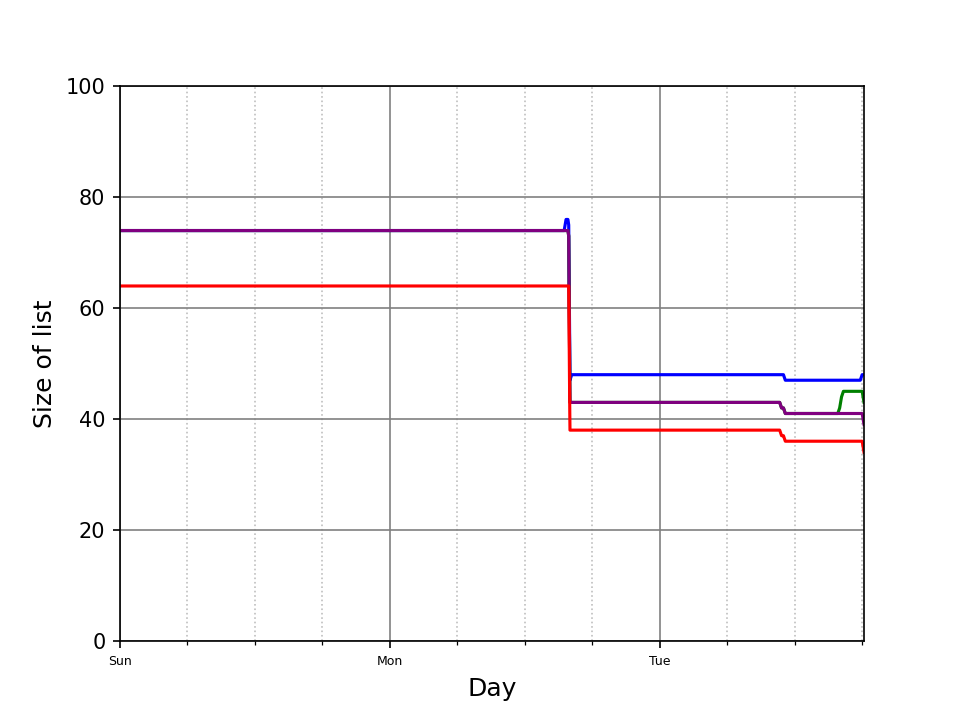

# Public Todo List 

My todo list is public. It's split into two parts. My personal list, and my work list. 
It's updated every hour or so when my machine is running. That script also updates a chart showing the size of the lists over time.  

## Personal list

<pre>
 
</pre>

## Work list 

<pre>
 
</pre>
